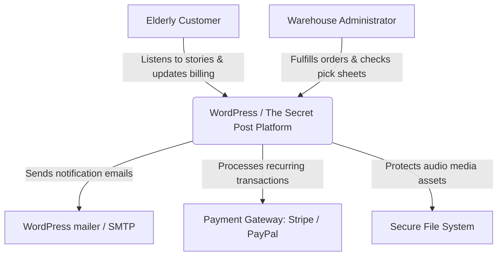
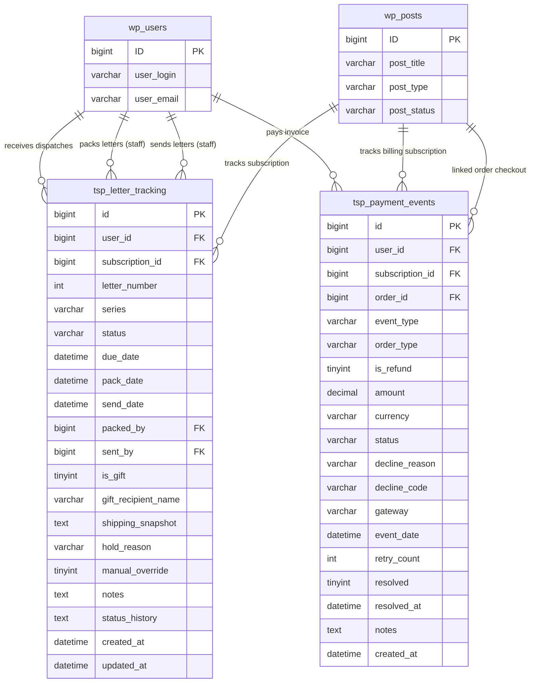

# Architectural Specifications & System Integrations

This document outlines the detailed system architecture, container boundaries, Entity Relationship Diagram (ERD), and external integration maps of the **The Secret Post Platform** using standard C4 Model notation.

---

## 1. C4 Model - Level 1: System Context Diagram

The System Context diagram details how users (Customers and Administrators) interact with **The Secret Post Platform** within the WordPress ecosystem:



* **System Boundaries:** The Secret Post Platform encapsulates user progression logic, dunning bots, and physical logistics inside standard WordPress hooks and custom database schemas.

---

## 2. C4 Model - Level 2: Container Diagram

The Container diagram details the internal structural components of **The Secret Post Platform**:

```mermaid
graph TD
    subgraph Client Application
        A1[Web Browser - Customer View]
        A2[Web Browser - Admin Panel]
    end

    subgraph The Secret Post Platform (WordPress Plugin)
        B1[Interception Controller]
        B2[Fulfillment & Logistics Engine]
        B3[Secure Streaming Engine]
        B4[Dunning Bot Engine]
        
        B1 -->|Intercepts Mini-Carts| B5(CartFlows Router)
    end

    subgraph Database Storage
        C1[Custom: tsp_letter_tracking]
        C2[Custom: tsp_payment_events]
        C3[WooCommerce: wp_wc_orders]
        C4[WordPress: wp_users / wp_posts]
    end

    A1 -->|Requests audio links| B3
    A2 -->|Manages fulfillment actions| B2
    
    B2 -->|Reads/Writes logs| C1
    B4 -->|Evaluates payments| C2
    B3 -->|Checks active user profiles| C4
    B1 -->|Saves billing metadata| C3
```

---

## 3. Entity Relationship Diagram (ERD)

This diagram details the physical database columns, constraints, and relationships connecting custom database layouts with native WordPress and WooCommerce tables:



---

## 4. Integration Map & Core Dependencies

The system integrates closely with multiple critical third-party dependencies within the WordPress marketplace:

### A. WooCommerce Core & HPOS
* **Integration Strategy:** Stores order customizations (such as `'tsp_is_gift'` and `'tsp_gift_message'`) cleanly within standard WooCommerce High-Performance Order Storage (HPOS) configurations. Hook actions ensure fields are loaded in billing screens and fully compliant with newer WC database systems.

### B. WooCommerce Subscriptions
* **Integration Strategy:** Subscribes to critical action triggers (`woocommerce_subscription_payment_failed`, `woocommerce_subscription_status_updated`, and renewal payment webhook loops) to synchronize active letter progression arrays and trigger payment hold or activation states dynamically.

### C. CartFlows Step Builder
* **Integration Strategy:** Queries custom post types `cartflows_step` to identify custom checkout pages. Overrides standard cart and elementor widget endpoints, matching the active user's product selections to route them seamlessly into single-page CartFlows checkout scripts.

### D. WordPress Mailer & Cron Engines
* **Integration Strategy:** Schedules daily events (`tsp_daily_dunning_cron` and `tsp_daily_unlock_cron`) on the hosting WP Cron pipeline, triggering automated chasing alerts and drip emails natively through `wp_mail()`.
