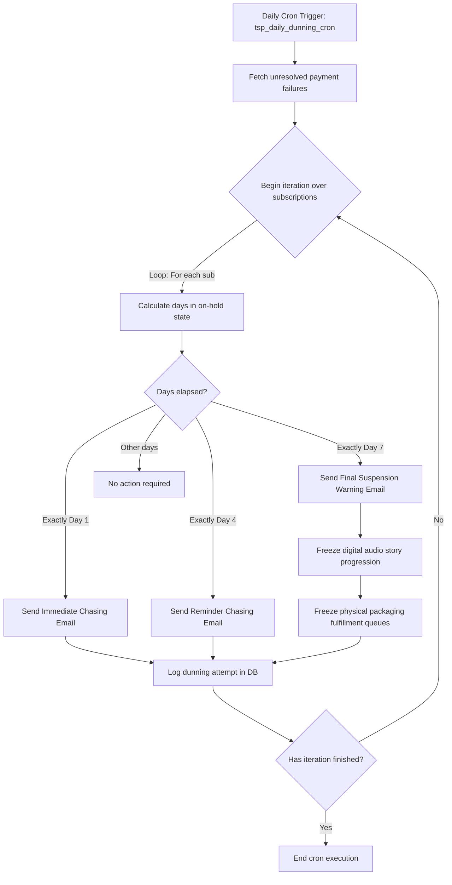

# Dunning Automated Bot & Chasing Flowchart

This document details the automated dunning sequence executed daily by **The Secret Post Platform** to process payment chasing notices for failed subscription renewals.

---

## Technical Flowchart

---

## Dunning Schedule Specifications

The chasing schedule is structured as a three-stage email layout to optimize recovery rates for the elderly target audience:
* **Stage 1 (Day 1 - Immediate Chasing):** Friendly initial notification providing direct checkout links to update billing credentials.
* **Stage 2 (Day 4 - Middle Chasing):** Warning alert emphasizing potential disruption to physical deliveries and story unlocks.
* **Stage 3 (Day 7 - Suspension Chasing):** Formal notification confirming full progression freeze (both digital listenings and physical packaging are frozen until accounts are settled).
