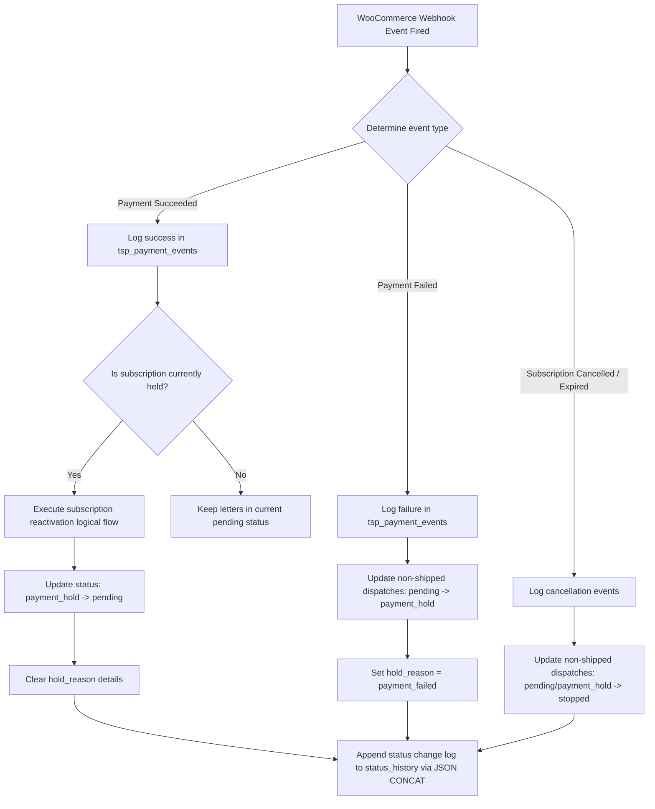

# Payment Event Tracking & State Transitions Flowchart

This document details how **The Secret Post Platform** reacts to passive WooCommerce and WC Subscriptions webhook actions to update relational tables and shift fulfillment logistics.

---

## Technical Flowchart

---

## Technical Mechanics & Optimization

* **Direct Raw SQL Updates:** Rather than retrieving and saving entire Eloquent/WordPress array payloads which degrades system responsiveness during high-volume payment spikes, the database layers make direct use of bulk operations (`$wpdb->query` statements).
* **Gateway-Agnostic Resolution:** Gateway failure notes (e.g., Stripe card declines, Asaas Pix timeout, PayPal cancellations) are parsed cleanly to populate the `decline_reason` and `decline_code` attributes.
