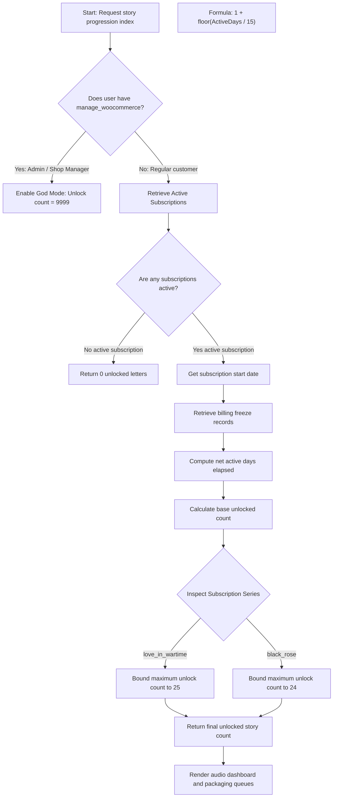

# Story Progression & Unlocking Mechanism Flowchart

This document details the bi-weekly progression calculation logic used by **The Secret Post Platform** to determine which physical letters and associated audio files are accessible to a customer.

---

## Technical Flowchart

---

## Net Active Days Formula

To prevent users from gaining unauthorized access to letters while their payments are failing, the progression timeline calculations perform dynamic offsets:

$$\text{Net Active Days} = \text{Total Elapsed Days} - \text{Total Freeze Duration}$$

Where:
* **Total Elapsed Days:** Days between `subscription_start_date` and `current_time`.
* **Total Freeze Duration:** Sum of days accumulated between status change logs of `active` $\to$ `on-hold` and subsequent reactivations `on-hold` $\to$ `active` in relational databases.
* **God Mode Override:** Safely bypasses the entire equation for admin QA testing environments, returning immediate full platform capability.
